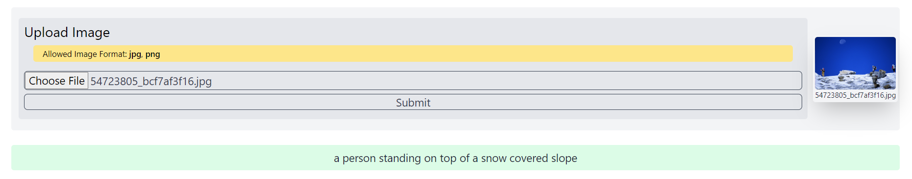

# Image Captioning

This is an project based on image-to-text model where the system takes an image as input and tends to generate caption for the image as text. The images are uploaded in correct format. 

Currently only <b>jpg</b> and <b>png</b> images are allowed.

The user was presented to upload image files which he/she wants to caption.

The generated caption will be presented below. The user will be able to upload as many times as the user wants.

